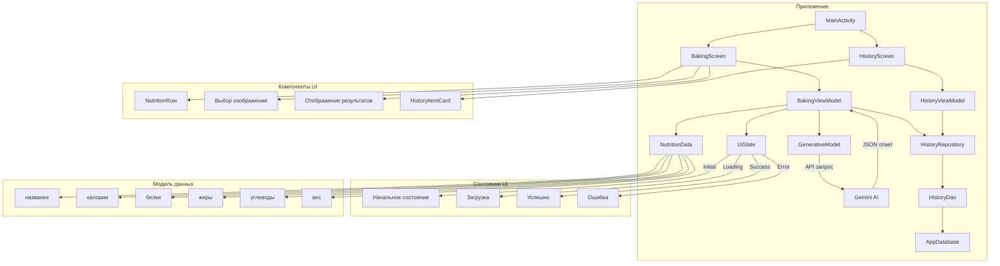

# Приложение для расчета КБЖУ по фотографии

## Описание проекта
Приложение предназначено для быстрого анализа пищевой ценности (калории, белки, жиры, углеводы) продуктов питания по фотографии. Используя возможности искусственного интеллекта Gemini API, приложение способно распознать продукт на фотографии и определить его пищевую ценность, а также примерный вес продукта.

## Скриншоты 

| Главное меню | История |
|--------------|---------|
|  |  |

## Настройка API-ключа

Для работы приложения требуется API-ключ Gemini. API-ключ хранится в файле `local.properties`, который не включается в систему контроля версий Git.

### Инструкция по настройке API-ключа:

1. Получите API-ключ Gemini на [официальном сайте Google AI Studio](https://ai.google.dev/).
2. Откройте файл `local.properties` в корне проекта (если файла нет, создайте его).
3. Добавьте строку с вашим API-ключом:
   ```
   apiKey=ВАШ_API_КЛЮЧ
   ```
4. Приложение автоматически загрузит ключ при сборке и включит его в BuildConfig.
5. Никогда не передавайте свой API-ключ другим пользователям и не добавляйте файл `local.properties` в репозиторий.

> **Важно:** Файл `local.properties` автоматически исключён из системы контроля версий через `.gitignore`, что гарантирует безопасность вашего API-ключа.

## Основные функции
1. **Загрузка изображения** - возможность загрузить фотографию продукта из галереи устройства
2. **Анализ изображения** - распознавание продукта и расчет КБЖУ с помощью Gemini API
3. **Структурированное отображение результатов** - вывод названия продукта, примерного веса и его пищевой ценности в удобном формате
4. **История запросов** - сохранение результатов анализа в базу данных с возможностью их просмотра позднее
5. **Управление историей** - возможность просматривать, удалять отдельные записи или очищать всю историю запросов

## Технические характеристики
- Используется Jetpack Compose для построения пользовательского интерфейса
- Интеграция с Gemini API для анализа изображений
- Parses JSON-ответы от Gemini API с помощью библиотеки Gson
- Room Database для хранения истории запросов
- Jetpack Navigation для перемещения между экранами
- Работа с изображениями и доступ к медиатеке устройства
- Обработка и отображение данных в реальном времени

## Стек технологий
- **Язык программирования**: Kotlin
- **Фреймворк UI**: Jetpack Compose
- **Архитектура**: MVVM (Model-View-ViewModel)
- **Асинхронные операции**: Kotlin Coroutines, Flow
- **Парсинг данных**: Gson
- **Локальное хранение**: Room Database
- **Навигация**: Jetpack Navigation Compose
- **AI API**: Google Generative AI (Gemini)

## Как использовать приложение
1. Запустите приложение
2. Нажмите кнопку "Загрузить изображение" и выберите фотографию продукта из галереи
3. Нажмите кнопку "Рассчитать КБЖУ"
4. Дождитесь окончания анализа и просмотрите результаты
5. Нажмите кнопку "История" для просмотра предыдущих запросов

## Структура проекта
- **MainActivity.kt** - точка входа в приложение с навигацией между экранами
- **BakingScreen.kt** - основной экран приложения с пользовательским интерфейсом
- **BakingViewModel.kt** - ViewModel для управления бизнес-логикой и взаимодействия с Gemini API
- **NutritionData.kt** - модель данных для хранения информации о пищевой ценности
- **UiState.kt** - состояния UI для отображения процесса загрузки, успешного результата или ошибки
- **HistoryScreen.kt** - экран для отображения истории запросов
- **HistoryViewModel.kt** - ViewModel для управления данными истории запросов
- **HistoryItem.kt** - модель данных для хранения записей в истории
- **HistoryDao.kt** - интерфейс для доступа к данным истории
- **AppDatabase.kt** - конфигурация базы данных Room
- **HistoryRepository.kt** - репозиторий для работы с данными истории
- **NavGraph.kt** - определение навигационных маршрутов приложения

## Архитектурная диаграмма приложения



## Требования к системе
- Android 11.0 (API уровень 30) или выше
- Доступ к интернету
- Доступ к медиатеке устройства

## Реализованные улучшения
1. **Замена предустановленных изображений** на возможность загрузки собственных фотографий
2. **Добавление специального запроса к Gemini API** для получения данных о КБЖУ в формате JSON
3. **Парсинг JSON-ответа** и преобразование его в структурированный объект
4. **Разработка UI компонентов** для наглядного отображения пищевой ценности продукта
5. **Обработка различных состояний приложения** (загрузка, успех, ошибка)
6. **Определение примерного веса продукта** с отображением этой информации в интерфейсе
7. **Обработка специфических ошибок Gemini API**, включая проблемы с геолокацией
8. **Система сохранения истории запросов** с возможностью управления сохраненными данными
9. **Многоэкранная навигация** с использованием Jetpack Navigation Compose
